<div align="center">

# Nova RL

### Game-style reinforcement learning arena for ETL data remediation



<br/>


</div>

---

## What Is Nova RL?

Nova RL turns ETL data cleanup into a small reinforcement learning game.

An agent receives a noisy tabular batch, reads the current data quality state, chooses a remediation move, and gets scored from `0.0` to `1.0`. The challenge is to improve data quality without over-quarantining rows or promoting unsafe output.

---

## Task Arena

| Level | Mission | Agent must learn |
|---|---|---|
| Easy | Nulls and exact duplicates | Clean obvious row-level issues safely |
| Medium | Type mismatches and malformed dates | Repair values without damaging valid records |
| Hard | Schema drift and correlated issues | Handle multi-column quality failures |

```text
EASY    [################----] 80%
MEDIUM  [###########---------] 54%
HARD    [#########-----------] 47%
```

---

## How A Round Works

```text
Noisy batch -> observation -> agent action -> environment update -> grader -> score
```

The environment loop is intentionally simple:

| Call | Purpose |
|---|---|
| `reset()` | Start a new task episode |
| `state()` | Read current batch signals and metrics |
| `step(action)` | Apply one remediation action |
| `finalize` | End the episode and submit output for scoring |

---

## Action Deck

| Action | Use it when |
|---|---|
| `fix` | The batch has repairable anomalies |
| `quarantine` | Bad records should be isolated instead of promoted |
| `promote` | The current output is clean enough to approve |
| `noop` | The safest move is to leave the batch unchanged |
| `finalize` | The agent is ready to end the episode |

---

## API Console

| Method | Endpoint | Purpose |
|---|---|---|
| `GET` | `/ping` | Liveness check |
| `GET` | `/health` | Runtime health status |
| `GET` | `/reset` | Reset the environment |
| `GET` | `/state` | Fetch the current observation |
| `POST` | `/step` | Submit an agent action |

---

## Quick Start

```bash
pip install -r requirements.txt
cp .env.example .env
python inference.py
```

Run the API locally:

```bash
uvicorn app:app --host 0.0.0.0 --port 8000
```

---

## Project Layout

```text
NOVA_RL/
|-- app.py
|-- inference.py
|-- Dockerfile
|-- openenv.yaml
|-- requirements.txt
|-- assets/
|   `-- nova-dashboard.svg
`-- nova_rl_env/
    |-- environment.py
    |-- datagen.py
    |-- graders.py
    |-- tasks.py
    |-- rewards.py
    `-- models.py
```

---

## Expand The Internals

<details>
<summary><strong>Observation signals</strong></summary>

- task id
- step index and remaining steps
- batch size
- anomaly counts by type
- data quality metrics
- issue summaries
- previous action summary

</details>

<details>
<summary><strong>Reward design</strong></summary>

- reward clean remediation
- penalize unsafe promotion
- penalize excessive quarantine
- penalize wasted steps
- keep scoring deterministic for benchmark runs

</details>

<details>
<summary><strong>Environment variables</strong></summary>

- `OPENAI_API_KEY`
- `HF_TOKEN`
- `API_KEY`
- `API_BASE_URL`
- `MODEL_NAME`

</details>

---

## Contributors

- Aryan Verma
- Aadyaa Soni

<div align="center">

### Built for deterministic ETL cleanup, agent evaluation, and hackathon demos.

</div>
