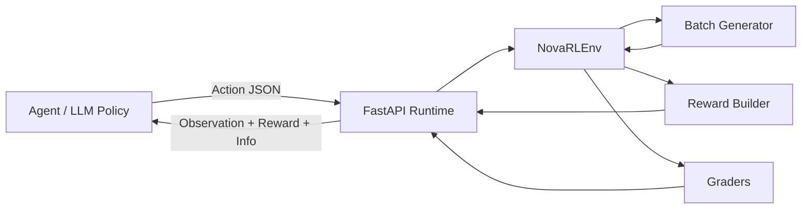

<div align="center">


[](https://www.python.org/)
[](https://fastapi.tiangolo.com/)
[](https://cloud.google.com/run)
[](https://ai.google.dev)
[](https://firebase.google.com)
[](#overview)


</div>

## Overview

**Nova RL** is an OpenEnv-style reinforcement learning environment for **ETL data quality remediation**.  
It simulates noisy tabular data batches, exposes typed observations to an agent, accepts structured remediation actions, and returns deterministic rewards plus end-of-episode grading across three benchmark levels: `easy`, `medium`, and `hard`.

This repo currently packages:

- a `NovaRLEnv` environment with typed observation/action models
- a FastAPI runtime with session-based `reset → state → step` flow
- **Google Gemini 2.5 Flash** LLM for intelligent ETL decisions
- **Firebase Firestore** async logging for session metadata & observability
- thread-safe session management with automatic TTL cleanup
- OpenEnv-compatible `server/` entrypoint for validator compatibility
- production-ready Docker image for **Google Cloud Run** deployment

## Architecture Overview

```
┌─────────────────────────────────────────────────────────────────┐
│                     Google Cloud Run (Auto-scaling)             │
│                                                                 │
│  ┌────────────────┐                                            │
│  │   FastAPI      │ ← HTTP Requests from LLM Agents           │
│  │   REST API     │                                            │
│  └────────┬───────┘                                            │
│           │                                                    │
│  ┌────────▼──────────────────────────────────────────────────┐ │
│  │  Session Manager (Thread-safe with 1-hour TTL)           │ │
│  └────────┬──────────────────────────────────────────────────┘ │
│           │                                                    │
│  ┌────────▼──────────────────────────────────────────────────┐ │
│  │  NovaRLEnv (per session)                                 │ │
│  │  ├─ Batch Generator (Synthetic anomalies)               │ │
│  │  ├─ Graders (Deterministic scoring)                     │ │
│  │  └─ Reward Builder (Dense signals)                      │ │
│  └────────┬──────────────────────────────────────────────────┘ │
│           │                                                    │
│  ┌────────▼──────────────────────────────────────────────────┐ │
│  │  Google Gemini 2.5 Flash (LLM Inference)               │ │
│  │  └─ Structured JSON decision-making                      │ │
│  └────────┬──────────────────────────────────────────────────┘ │
│           │                                                    │
│  ┌────────▼──────────────────────────────────────────────────┐ │
│  │  Firebase Firestore (Async Logging)                      │ │
│  │  ├─ Session metadata                                      │ │
│  │  ├─ Step trajectories                                     │ │
│  │  └─ Episode summaries                                     │ │
│  └───────────────────────────────────────────────────────────┘ │
└─────────────────────────────────────────────────────────────────┘
```

## Why Nova RL

Nova RL is built around a practical benchmark idea: modern ETL systems do not just fail with one clean error type. They fail with overlapping faults such as:

- missing values
- exact duplicate rows
- malformed dates
- type mismatches
- schema drift

The environment turns those production-style cleanup problems into a repeatable agent loop where decisions can be benchmarked consistently.

## Architecture



## Current Workflow (Session-Based on Cloud Run)

```
[LLM Agent] ──(HTTP)──> [Cloud Run - FastAPI]
                               |
                    [Session Manager + Lock]
                               |
                        [NovaRLEnv Instance]
                          ├─ Batch Generator
                          ├─ Graders
                          └─ Reward Builder
                               |
                        [Gemini 2.5 Flash]
                    (structured JSON decisions)
                               |
                        [Firestore - Async]
                    (session metadata logging)
                               |
                    <-(Observation + Reward)──
```

**Per-Episode Sequence:**
1. Client: `POST /reset?task_id=easy` → Server creates unique `session_id`
2. Environment: Generates synthetic ETL batch (deterministic from seed)
3. Loop (up to 8 steps):
   - Client: Reads `/state?session_id=...` → Gets observation + metrics
   - Gemini: Calls API with observation → Returns structured action JSON
   - Client: `POST /step` with action decision
   - Environment: Executes action → computes reward + grade
   - Firestore: Async logs step trajectory
4. Terminal condition: `decision == "finalize"` OR `step_index >= max_steps`
5. Firestore: Logs episode summary (final score, trajectory, success flag)

## Benchmark Levels

| Task | Focus | Typical faults | Max steps |
| --- | --- | --- | --- |
| `easy` | Safe cleanup of obvious issues | `null`, `duplicate` | `8` |
| `medium` | Repair mixed data quality faults | `null`, `duplicate`, `type_mismatch`, `malformed_date` | `8` |
| `hard` | Handle schema drift and correlated failures | `null`, `duplicate`, `type_mismatch`, `malformed_date`, `schema_drift` | `8` |

## Observation Contract

Every step returns a typed `Observation` with the fields below:

| Field | Meaning |
| --- | --- |
| `task_id` | Active benchmark difficulty |
| `step_index` | Current step number |
| `max_steps` | Episode step cap |
| `batch_size` | Number of records in the current batch |
| `anomaly_counts` | Count of detected anomaly types |
| `current_metrics` | Rolling performance metrics |
| `sample_issue_summaries` | Human-readable summaries of active issues |
| `current_threshold` | Decision threshold currently in play |
| `remaining_steps` | Steps left before termination |
| `last_action` | Previous action decision |

## Action Space

Agents must return JSON compatible with the `Action` model:

```json
{
  "decision": "fix",
  "threshold": 0.62,
  "notes": "Repair high-confidence issues first",
  "parameters": {}
}
```

Supported `decision` values:

- `fix`
- `quarantine`
- `promote`
- `noop`
- `finalize`

## Quick Start

### 1. Install dependencies

```bash
pip install -r requirements.txt
```

### 2. Configure environment variables

Edit the local `.env` file before running inference:


- `GEMINI_API_KEY` when `LLM_PROVIDER=gemini`
- `GEMINI_MODEL` (optional, defaults to `gemini-2.5-flash`)

Optional Firebase memory settings:

- `GOOGLE_APPLICATION_CREDENTIALS` for local service account auth
- `NOVA_RL_FIRESTORE_COLLECTION` (optional, defaults to `nova_rl_sessions`)
- `NOVA_RL_MAX_PENDING_WRITES` (optional, defaults to `100`)
- `NOVA_RL_TASKS` (optional, defaults to `easy,medium,hard`)
- `NOVA_RL_MAX_STEPS` (optional, defaults to `8`)

### 3. Run the API locally

```bash
uvicorn app:app --host 0.0.0.0 --port 8080 --reload
```

Open `http://127.0.0.1:8080` to view the bundled UI.

For development on different port:
```bash
uvicorn app:app --host 0.0.0.0 --port 7860 --reload
```

### 4. Run baseline inference (Local)

```bash
python inference.py
```

Runs 3 tasks (easy, medium, hard) using **Google Gemini 2.5 Flash** with:
- ✅ 15-second timeout per API call
- ✅ Automatic retry on failure
- ✅ Safe fallback action if LLM response is invalid
- ✅ Async logging to Firestore (if configured)

## API Surface

All endpoints return JSON responses. Sessions are isolated and managed server-side.

| Method | Route | Purpose | Auth |
|--------|-------|---------|------|
| `GET` | `/ping` | Liveness check (for Cloud Run load balancer) | ❌ |
| `GET` | `/health` | Memory status + Firestore connection | ❌ |
| `GET` | `/reset` | Start session with query params | ❌ |
| `POST` | `/reset` | Start session with JSON body | ❌ |
| `GET` | `/state` | Fetch current observation | ❌ |
| `POST` | `/step` | Submit action, get reward + next state | ❌ |
| `GET` | `/` | Web UI (HTML) | ❌ |

> **Note:** When deploying to Cloud Run, add API key authentication to `/reset` and `/step` endpoints.

### Example Requests (Local Development)

#### 1. Reset Session

```bash
curl "http://127.0.0.1:8080/reset?task_id=medium&seed=42"
```

#### 2. Get Session State

```bash
curl "http://127.0.0.1:8080/state?session_id=YOUR_SESSION_ID"
```

#### 3. Execute Step (POST)

```bash
curl -X POST "http://127.0.0.1:8080/step?session_id=YOUR_SESSION_ID" \
  -H "Content-Type: application/json" \
  -d '{"decision":"fix","threshold":0.6,"notes":"repair obvious issues","parameters":{}}'
```

#### 4. On Google Cloud Run

```bash
# Replace [SERVICE-URL] with your Cloud Run service URL
curl "https://nova-rl-[HASH].a.run.app/reset?task_id=easy&seed=42"
curl "https://nova-rl-[HASH].a.run.app/health"
```

## Repository Layout

```text
NOVA_RL/
|-- pyproject.toml
|-- uv.lock
|-- app.py
|-- Dockerfile
|-- inference.py
|-- nova_ui.html
|-- openenv.yaml
|-- preload_models.py
|-- requirements.txt
|-- _app_preview.png
|-- server/
|   |-- __init__.py
|   `-- app.py
`-- nova_rl_env/
    |-- datagen.py
    |-- environment.py
    |-- graders.py
    |-- models.py
    |-- rewards.py
    `-- tasks.py
```

## Tech Stack (Google Cloud Native)

<div align="center">
  
</div>

### Core Infrastructure
- **Web Framework:** FastAPI + Uvicorn
- **Validation:** Pydantic v2
- **Data Processing:** NumPy, Pandas
- **Containerization:** Docker

### Google Cloud Services
- **LLM Inference:** [Google Gemini 2.5 Flash API](https://ai.google.dev) — structured JSON decisions with 15s timeout
- **Session Logging:** [Firebase Admin SDK](https://firebase.google.com) → Firestore (async, best-effort)
- **Deployment:** [Google Cloud Run](https://cloud.google.com/run) — managed, auto-scaling serverless
- **Authentication:** [Google Cloud IAM](https://cloud.google.com/iam) (service account credentials)

### Environment & Validation
- **OpenEnv compatibility:** `server.app:main` entrypoint + `openenv.yaml` metadata
- **RL Loop:** Custom session-based trajectory collection with deterministic grading
- **Error Handling:** Structured logging, graceful fallbacks on LLM failures
- **Memory Safety:** Thread-safe session manager with 1-hour TTL and automatic cleanup

## Deployment on Google Cloud Run

### Prerequisites

1. **Google Cloud Project**
   ```bash
   gcloud projects create nova-rl-prod
   gcloud config set project nova-rl-prod
   ```

2. **Enable APIs**
   ```bash
   gcloud services enable run.googleapis.com firestore.googleapis.com
   ```

3. **Create Firebase Service Account**
   ```bash
   gcloud iam service-accounts create nova-rl-sa
   gcloud projects add-iam-policy-binding nova-rl-prod \
     --member=serviceAccount:nova-rl-sa@nova-rl-prod.iam.gserviceaccount.com \
     --role=roles/datastore.user
   ```

4. **Generate Credentials JSON**
   ```bash
   gcloud iam service-accounts keys create firebase-key.json \
     --iam-account=nova-rl-sa@nova-rl-prod.iam.gserviceaccount.com
   ```

### Deploy to Cloud Run

```bash
gcloud run deploy nova-rl \
  --source . \
  --platform managed \
  --region us-central1 \
  --memory 2Gi \
  --timeout 3600 \
  --allow-unauthenticated \
  --set-env-vars \
    GEMINI_API_KEY=your-api-key,\
    GEMINI_MODEL=gemini-2.5-flash,\
    GOOGLE_CLOUD_PROJECT=nova-rl-prod,\
    NOVA_RL_FIRESTORE_COLLECTION=nova_rl_sessions,\
    NOVA_RL_MAX_PENDING_WRITES=100,\
    NOVA_RL_TASKS=easy,medium,hard
```

### Key Configuration

| Variable | Value | Purpose |
|----------|-------|----------|
| `GEMINI_API_KEY` | Your API key | LLM inference |
| `GOOGLE_CLOUD_PROJECT` | `nova-rl-prod` | Firestore location |
| `GOOGLE_APPLICATION_CREDENTIALS` | Service account JSON | Firebase auth |
| `PORT` | `8080` | Cloud Run requirement |
| `NOVA_RL_MAX_PENDING_WRITES` | `100` | Firestore batch size |

### Health Checks

```bash
# Check if service is alive
curl https://nova-rl-[HASH].a.run.app/ping

# Check Firestore connection
curl https://nova-rl-[HASH].a.run.app/health
```

## Google Cloud Deployment Best Practices

### Production Checklist

- ✅ Use **Cloud IAM Service Accounts** (not personal keys)
- ✅ Store `GEMINI_API_KEY` in **Secret Manager**, not `.env`
- ✅ Enable **VPC Service Controls** for Firestore isolation
- ✅ Set up **Cloud Monitoring** alerts for:
  - `/health` endpoint pending_writes > 50
  - Gemini API error rate > 5%
  - Cloud Run latency p95 > 2s
- ✅ Use **Cloud CDN** for static assets (nova_ui.html)
- ✅ Enable **Cloud Logging** with structured JSON output
- ✅ Set **Firestore backup** to daily

### Scaling Considerations

| Component | Limit | Recommendation |
|-----------|-------|----------------|
| Cloud Run concurrency | 1000 | Default: 80 (adjust if needed) |
| Firestore write rate | 10k writes/sec | Monitor with `/health` |
| Gemini API rate | 1000 req/min | Queue requests if exceeding |
| Session TTL | 3600 seconds | Suitable for 1-hour training runs |
| Max batch size | 1000 records | Prevents OOM on 2Gi instances |

### Example Monitoring Dashboard (Cloud Monitoring)

```yaml
# Create dashboard with:
- Cloud Run requests (rate, latency, errors)
- Firestore write latency + volume
- Gemini API calls (success rate, p95 latency)
- Memory usage per Cloud Run instance
```

### Cost Estimation (Monthly)

- **Cloud Run:** ~$50 (2 Gi, 100 instances avg)
- **Firestore:** ~$20 (1M writes/month)
- **Gemini API:** ~$100 (assuming 10k calls/month)
- **Cloud Logging:** ~$5
- **Total:** ~$175/month for moderate load

## Baseline Score Snapshot

Representative integration checks recorded these valid benchmark outputs:

| Task | Score |
| --- | --- |
| `easy` | `0.8000` |
| `medium` | `0.5375` |
| `hard` | `0.4725` |

## Future Implementation

- Replace approximate reward attribution with stronger counterfactual credit assignment for more stable multi-agent learning.
- Add confidence calibration on model-generated remediation outputs so threshold decisions stay reliable under noisy cases.
- Expand the synthetic generator with richer real-world anomaly patterns, correlated faults, and domain-randomized episode settings.
- Introduce safer memory and retrieval write-back rules so only high-quality remediations are reused in later episodes.
- Evolve the current linear episode flow into a graph-style remediation loop with retry, backtracking, and re-evaluation steps.

## Project Context

Nova RL was built as an **OpenEnv-based ETL remediation benchmark** for the **Meta / PyTorch x Hugging Face x Scaler SST Hackathon**.

Deployed on **Google Cloud Run** with **Gemini 2.5 Flash** for intelligent ETL decision-making and **Firebase Firestore** for scalable session logging.

## Contributors

- **Aryan**: Environment design, inference loop, Gemini integration, Cloud Run deployment, production-ready error handling
- **Aadyaa**: Task specification, synthetic data generation, deterministic grading logic, reward shaping

## Links

- GitHub: [aryanvr961/Nova_RL](https://github.com/aryanvr961/Nova_RL)


<div align="center">
  
</div>
