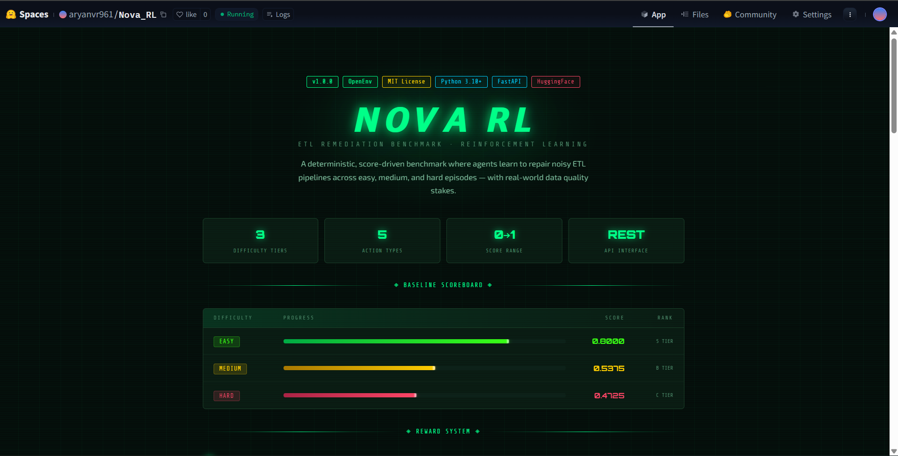
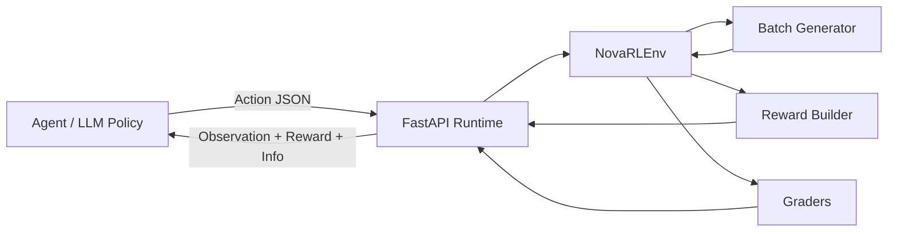

<div align="center">


[](https://www.python.org/)
[](https://fastapi.tiangolo.com/)
[](#architecture)
[](https://huggingface.co/spaces/aryanvr961/Nova_RL)
[](#overview)


</div>

## Overview

**Nova RL** is an OpenEnv-style reinforcement learning environment for **ETL data quality remediation**.  
It simulates noisy tabular data batches, exposes typed observations to an agent, accepts structured remediation actions, and returns deterministic rewards plus end-of-episode grading across three benchmark levels: `easy`, `medium`, and `hard`.

This repo currently packages:

- a `NovaRLEnv` environment with typed observation/action models
- a FastAPI runtime with session-based `reset -> state -> step` flow
- a baseline LLM inference loop using the OpenAI Python client
- an OpenEnv-compatible `server/` entrypoint plus packaging metadata for validation
- Hugging Face Space deployment files and a custom HTML landing UI

## Preview

<div align="center">
  <a href="https://huggingface.co/spaces/aryanvr961/Nova_RL">
    
  </a>
</div>

## Why Nova RL

Nova RL is built around a practical benchmark idea: modern ETL systems do not just fail with one clean error type. They fail with overlapping faults such as:

- missing values
- exact duplicate rows
- malformed dates
- type mismatches
- schema drift

The environment turns those production-style cleanup problems into a repeatable agent loop where decisions can be benchmarked consistently.

## Architecture



## Current Workflow

```text
1. Client calls `/reset` with a task id and optional seed
2. FastAPI creates or reuses a session-scoped NovaRLEnv
3. The environment generates a noisy ETL batch for that task
4. The agent reads the observation payload
5. The agent returns one structured action
6. NovaRLEnv updates metrics, reward, and grade signals
7. The loop continues until finalize or max_steps is reached
```

## Benchmark Levels

| Task | Focus | Typical faults | Max steps |
| --- | --- | --- | --- |
| `easy` | Safe cleanup of obvious issues | `null`, `duplicate` | `8` |
| `medium` | Repair mixed data quality faults | `null`, `duplicate`, `type_mismatch`, `malformed_date` | `8` |
| `hard` | Handle schema drift and correlated failures | `null`, `duplicate`, `type_mismatch`, `malformed_date`, `schema_drift` | `8` |

## Observation Contract

Every step returns a typed `Observation` with the fields below:

| Field | Meaning |
| --- | --- |
| `task_id` | Active benchmark difficulty |
| `step_index` | Current step number |
| `max_steps` | Episode step cap |
| `batch_size` | Number of records in the current batch |
| `anomaly_counts` | Count of detected anomaly types |
| `current_metrics` | Rolling performance metrics |
| `sample_issue_summaries` | Human-readable summaries of active issues |
| `current_threshold` | Decision threshold currently in play |
| `remaining_steps` | Steps left before termination |
| `last_action` | Previous action decision |

## Action Space

Agents must return JSON compatible with the `Action` model:

```json
{
  "decision": "fix",
  "threshold": 0.62,
  "notes": "Repair high-confidence issues first",
  "parameters": {}
}
```

Supported `decision` values:

- `fix`
- `quarantine`
- `promote`
- `noop`
- `finalize`

## Quick Start

### 1. Install dependencies

```bash
pip install -r requirements.txt
```

### 2. Configure environment variables

```bash
cp .env.example .env
```

Set these values before running the baseline inference flow:

- `API_BASE_URL`
- `MODEL_NAME`
- `HF_TOKEN`

Fallback credentials are also supported:

- `OPENAI_API_KEY`
- `API_KEY`

### 3. Run the API locally

```bash
uvicorn app:app --host 0.0.0.0 --port 7860 --reload
```

Open `http://127.0.0.1:7860` to view the bundled UI.

### 4. Run baseline inference

```bash
python inference.py
```

By default, the inference client targets:

```text
https://router.huggingface.co/v1
```

and reads the model from `MODEL_NAME`.

## API Surface

| Method | Route | Purpose |
| --- | --- | --- |
| `GET` | `/` | HTML landing page |
| `GET` | `/ping` | Liveness check |
| `GET` | `/health` | Health status |
| `GET` | `/reset` | Start or reset a session and task with query params |
| `POST` | `/reset` | Validator-friendly reset with JSON body |
| `GET` | `/state` | Fetch current session observation |
| `POST` | `/step` | Submit an action for the session |

Example `GET /reset` call:

```bash
curl "http://127.0.0.1:7860/reset?task_id=medium&seed=42"
```

Example `POST /reset` call:

```bash
curl -X POST "http://127.0.0.1:7860/reset" \
  -H "Content-Type: application/json" \
  -d "{\"task_id\":\"medium\",\"seed\":42}"
```

Example step call:

```bash
curl -X POST "http://127.0.0.1:7860/step?session_id=YOUR_SESSION_ID" \
  -H "Content-Type: application/json" \
  -d "{\"decision\":\"fix\",\"threshold\":0.6,\"notes\":\"repair obvious issues\",\"parameters\":{}}"
```

## Repository Layout

```text
NOVA_RL/
|-- pyproject.toml
|-- uv.lock
|-- app.py
|-- inference.py
|-- nova_ui.html
|-- openenv.yaml
|-- preload_models.py
|-- requirements.txt
|-- _app_preview.png
|-- server/
|   |-- __init__.py
|   `-- app.py
`-- nova_rl_env/
    |-- datagen.py
    |-- environment.py
    |-- graders.py
    |-- models.py
    |-- rewards.py
    `-- tasks.py
```

## Tech Stack

<div align="center">
  
</div>

- **Core runtime:** FastAPI, Pydantic
- **Environment logic:** custom OpenEnv-style RL loop
- **Inference:** OpenAI Python client with HF router compatibility
- **Validation compatibility:** OpenEnv packaging metadata plus `server.app:main`
- **Data tooling:** NumPy, pandas, scikit-learn
- **Deployment target:** Hugging Face Space via `Dockerfile` + `openenv.yaml`

## Deployment

This project is already structured for Hugging Face Space deployment:

- [`Dockerfile`](./Dockerfile)
- [`openenv.yaml`](./openenv.yaml)
- [`app.py`](./app.py)
- [`server/app.py`](./server/app.py)
- [`pyproject.toml`](./pyproject.toml)

Space runtime metadata currently declares:

```yaml
spec_version: 1
name: nova-rl
type: space
runtime: fastapi
app: app:app
port: 7860
```

OpenEnv validation compatibility is also included via:

- `server.app:main` entrypoint in [`pyproject.toml`](./pyproject.toml)
- lightweight compatibility package in [`server/app.py`](./server/app.py)
- lockfile placeholder in [`uv.lock`](./uv.lock)

## Baseline Score Snapshot

Representative integration checks recorded these valid benchmark outputs:

| Task | Score |
| --- | --- |
| `easy` | `0.8000` |
| `medium` | `0.5375` |
| `hard` | `0.4725` |

## Project Context

Nova RL was built as an **OpenEnv-based ETL remediation benchmark** for the **Meta / PyTorch x Hugging Face x Scaler SST Hackathon**.

## Contributors

- **Aryan**: environment, models, rewards, inference, deployment-facing files
- **Aadyaa**: tasks, synthetic data generation, grading logic, task-facing documentation

## Links

- GitHub: [aryanvr961/Nova_RL](https://github.com/aryanvr961/Nova_RL)
- Hugging Face Space: [aryanvr961/Nova_RL](https://huggingface.co/spaces/aryanvr961/Nova_RL)

<div align="center">
  
</div>
